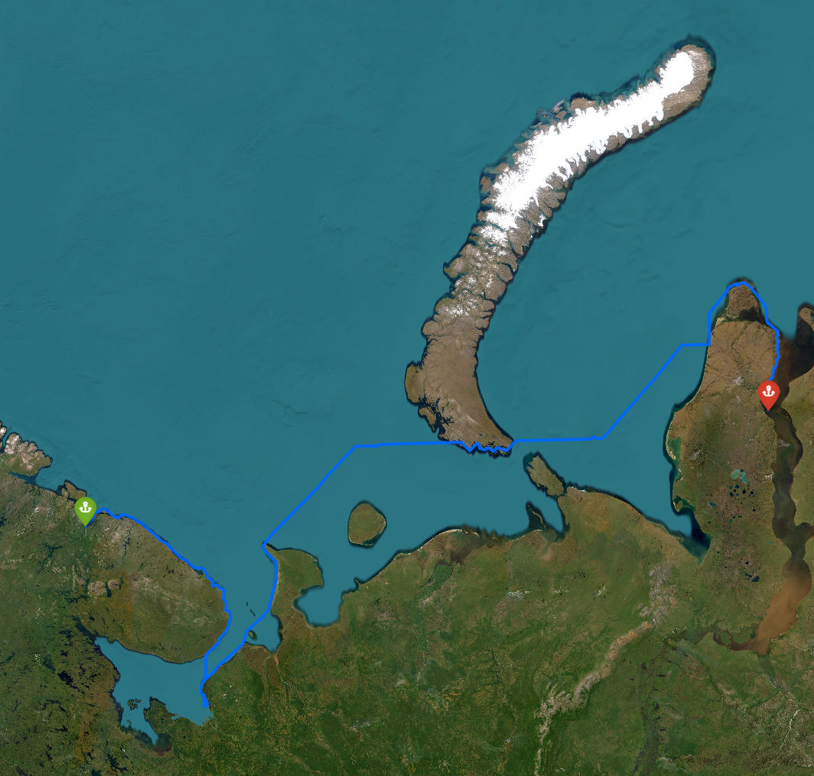
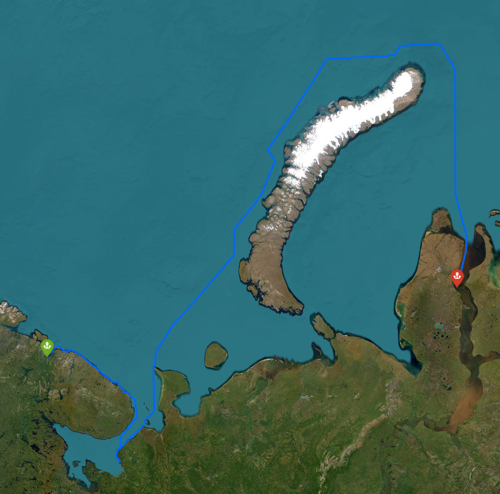
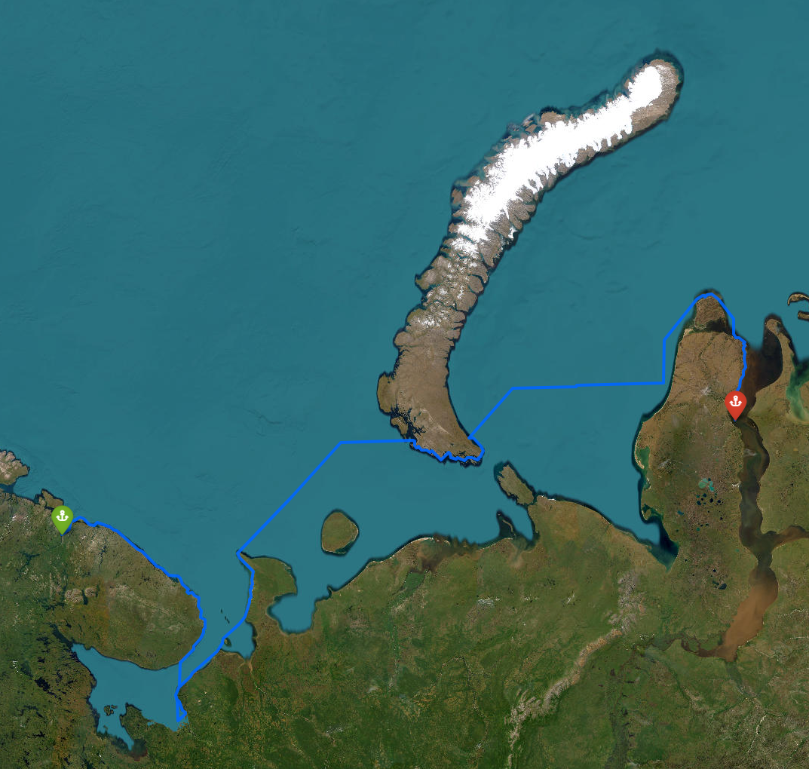

# ArctIS

## 1. Суть проекта

**ArctIS** (Arctic AIS) - система для построения и оптимизации морских маршрутов между портами Арктики с учетом ледовой <br> обстановки и ограничений навигации.

- Пользователь задает исходную и конечную точку маршрута (порты), а также сценарий - месяц навигации/ледовую ситуацию.
- Система моделирует регуллярную сетку маршрута между этими точками, учитывая:

    - **Координаты и форму акватории**
    - **Ледовые зоны**
    - **Береговую линию**
    - **Особые опасные зоны**
- В результате рассчитывается маршрут с минимальной стоимостью: времени, расстояния и сложности прохождения ледовых участков.
- Итоговый путь визуализируется на интерактивной карте, экспортируется в стандартные GIS-форматы: CSV, GeoJSON, KML.

## Структура проекта

```
python
├───config
│   ├───coastline_simple.py
│   ├───ice_hazard_zones.py
│   ├───july.geojson
│   ├───march.geojson
│   ├───novice.geojson
│   └───ne_10m_land.geojson
├───output
│   ├───routes (карта с самым кратчайшим путем среди трех вариантов) 
│   ├───routes_july (карта с кратчайщим путем для кораблей за июль)
│   ├───routes_march (карта с кратчайщим путем для кораблей за март)
│   └───routes_nov (карта с кратчайщим путем для кораблей за ноябрь)
├───scripts
│   └───run_routing.py
└───src
    ├───preprocessing
    │   ├───ice_hazard_processor.py
    │   └───land_sea_mask.py
    ├───routing
    │   ├───astar.py
    │   └───cost_function.py
    ├───utils
    │   └───geo_utils.py
    └───visualization
        └───map_plotter.py
```

---

## 2. Основные алгоритмы

### A. Построение маски акватории и суши (`land_sea_mask.py`)

- Используются глобальные геополигональные данные в формате GeoJSON.
- Формируется двумерная булева маска: для каждой точки сетки определяется, является ли она морем или сушей.
- Это позволяет не допустить прокладку маршрута по суше и мгновенно фильтровать все запрещенные шаги.

---

### B. Обработка ледовой информации (`ice_hazard_processor.py`, `ice_hazard_zones.py`)

- Данные о ледовых полях загружаются из статических конфигов (`ICE_HAZARD_ZONES`) или, <br>
  при наличии, из спутниковых снимков.
- Для каждой точки сетки выбирается источник (статический или свежий спутник).
- Для каждого участка маршрута рассчитываются:

    - **Концентрация льда** (fraction)
    - **Толщина льда** (метры)
    - **Степень опасности**: none / low / medium / high
    - Отдельно маркируются точечные опасные зоны (`ICE_POINT_HAZARDS`) с радиусом действия.

---

### C. Поиск оптимального маршрута: Алгоритм А* (`astar.py`)

- Маршрут проходит по сетке (определенное разрешение по широте/долготе), где каждая точки анализируется по стоимости перехода:

    - Участок по чистой воде - минимальная стоимость
    - По льду - увеличенная стоимость
    - В тяжелом/опасном льду - резко выше
- В расчет включаются:

    - **Параметры судна** (класс, скорости в чистой воде/льду)
    - **Маски береговой линии и запрещенных зон**

- Реализация А*:
  1. Инициализация стартовой точки
  2. Поиск допустимых соседей на сетке (только по воде, без выхода на сушу)
  3. В расчет стоимости шага входит информация о льде
  4. По достижении цели - восстановление и запись маршрута по точкам
  
---

### D. Визуализация и экспорт маршрута (`map_plotter.py`)

- Визуализация маршрута на интерактивной карте с помощью folium:

    - Подложки различных карт
    - Маркеры портов и ключевых точек маршрута
    - Визуализация маски льда и береговой линии
  
- Экспорт результата в HTML и стандартные GIS-форматы:

    - **GeoJSON** 
    - **KML**
    - **CSV**

---

## 3. Взаимодействие компонентов

- Основной сценарий - скрипт `run_routing.py`:

    - Получает входные параметры пользователя (точки, сценарий/месяц)
    - Запускает обработчики масок и ледовой обстановки
    - Вызывает алгоритм А* для построения оптимального маршрута
    - Запускает функции визуализации и экспорта маршрута
- Встроено несколько сценариев (разные сезоны, разные маски ограничений), моделируются типичные условия ледовой <br> обстановки для разных периодов года.

---

## 4. Результат работы скрипта

1. Оптимальный маршрут для корабля в июль:

2. Оптимальный маршрут для корабля в март:

3. Оптимальный маршрут для корабля в ноябрь:
